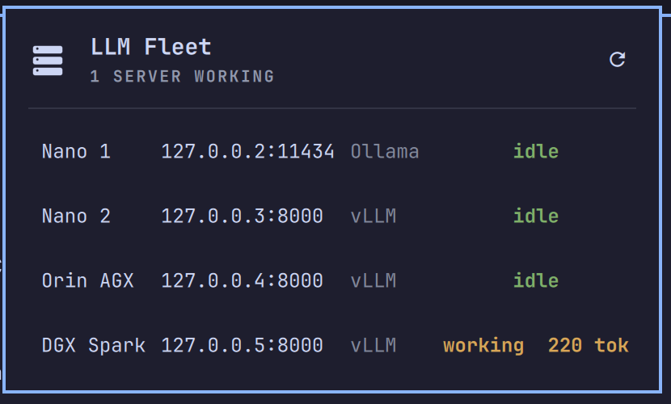

# LLM Fleet

An activity light for self-hosted LLM servers. It answers one question at a
glance: **is anything actually generating right now?**

Run against vLLM and Ollama. llama.cpp, SGLang and TGI are supported from their
published metric names but have not been run — see the table below.



## Why

If you run a model locally, you already know the feeling of not knowing. The fans
spun up — is that the model, or a browser tab? A request has been sitting there
for eight seconds — is it thinking, or did the server wedge? You kicked off a
long job before dinner — did it finish, or die at minute two?

Nothing on the desktop answers that. GPU telemetry tells you a card is warm,
which is not the same as tokens being produced: a wedged server sits at 60°C
looking exactly like a busy one. `nvidia-smi` in a spare terminal tells you about
one machine, and only while you are looking at it.

This puts the answer in the bar. The icon fills in when work is happening and
empties when it stops — and carries a small dot when it cannot honestly say
either, because nothing has been measured yet or nothing in the fleet is able to
report activity. An empty icon is a claim that work stopped, so it is only drawn
when that has actually been observed.

Open the panel and each server says what it is doing, with a live token count for
the ones that publish one. Each row also says **what** the node is running, and
whether it is struggling: the loaded model, how many requests are in flight and
queued behind them, and KV cache pressure once it means something. Those come
from the same response the activity signal does — no extra request, no agent to
install.

It is deliberately **not** a dashboard, a controller, or a cost tracker. It does
not start services, load models, change clocks, or bill anything, and it does
not report temperatures, fan speeds or driver versions — those live on the
*node*, not the inference server, and reading them would mean an agent on every
host. GPU telemetry is a solved problem and other plugins solve it. This one
answers the question they cannot: is inference actually happening, and with
what.

## Who it is for

- **One model on the machine you are sitting at.** Ollama on `localhost` counts
  as a fleet of one, and this is arguably where it earns its keep most: you are
  using the same GPU you are inferencing on, and "is it busy right now" is a real
  question with a real answer.
- **A box under the desk, or several.** Point it at each one and the bar tells you
  which is working without opening a terminal or an SSH session.
- **A mixed setup.** vLLM on the big machine, Ollama on the little one, llama.cpp
  on the laptop. Each is detected on its own terms.

If you only use hosted APIs, this is not for you — there is nothing to watch.

## What it supports

| Runtime | Detected by | Activity signal | Verified |
|---|---|---|---|
| vLLM | `vllm:` series on `/metrics` | generated-token counter, plus running/queued and KV cache | **live** |
| Ollama | `/api/ps` | keep-alive expiry advancing — proves work happened, never that none is; see below | **live** |
| llama.cpp | `llamacpp:` series on `/metrics` | predicted-token counter, plus processing/deferred | names |
| SGLang | `sglang:` series on `/metrics` | generated-token counter, plus running/queued | names |
| TGI | `tgi_` series on `/metrics` | generated-token histogram, batch and queue size | names |
| OpenAI-compatible | `/v1/models` | none — reported as reachable only | n/a |

**What "verified" means here, precisely.** *live* means I have run it against a
real server of that kind and characterised its activity signal under load —
vLLM and Ollama only. For vLLM that meant watching the counter move while it
generated; for Ollama it meant discovering that its signal does **not** move
while it generates, which is the paragraph below. *names* means the series it reads are confirmed against
that project's own source (llama.cpp's metrics test asserts these exact names
and types; SGLang's production-metrics reference; TGI's router source), and
the adapter is tested against a body in that shape — **but no such server has
ever been run against this plugin.** If you use one of those three, you are the
first, and I would genuinely like to hear whether it worked.

**Ollama has no token counter, and its signal only works in one direction.**
There is no `/metrics` endpoint, so nothing counts work. What Ollama exposes is
each resident model's keep-alive expiry — and it pushes that forward when a
request **completes**, not while one is running. Measured across a 25-second
generation: eight consecutive polls, all identical, advancing only once the
generation had finished.

So "the expiry did not move" is exactly what a *generating* server looks like,
and it cannot be read as idle. An Ollama row therefore says `working` shortly
after a generation finishes, and `no activity signal` the rest of the time —
never a green `idle` it has not earned. With `keep_alive: -1` the expiry is a
constant, so `no activity signal` is all it will ever say.

The one thing `/api/ps` does prove is an **empty** model list: nothing resident
cannot be generating, so that reads a true `idle`.

If you want a real activity light on one machine, vLLM, llama.cpp `--metrics`,
SGLang and TGI all publish a token counter and Ollama does not.

**"llama.cpp shows nothing"** almost always means `llama-server` was started
without `--metrics`. It serves no metrics endpoint unless asked to.

**A node serving several models at once reports one of them.** The model name is
read from the labels on the series it already fetches, and the first is shown.
The token counts are summed across every engine and model, so the *activity* is
right; the name beside it is not the whole story.

### What a row will not claim

Every state exists to keep the widget from saying something it has not measured.

| the row says | it means |
|---|---|
| `idle` | it asked, twice, and the work counter did not move |
| `working  N tok` | the counter moved by N between two readings |
| `measuring` | no comparable pair yet — first reading, a restarted counter, or a host not probed since you added it |
| `no activity signal` | it answered, but published nothing that counts work |
| `not responding` | it accepted the connection and then said nothing — wedged, not off |
| `unreachable` | it was asked and did not answer at all |

`measuring` and `no activity signal` are the two that matter: neither is `idle`,
because an absence of evidence is not evidence of quiet. A server restart resets
the token counter, and reading that negative delta as "no work" once drew a bold
green `idle` over a node that was serving four requests.

`idle` therefore means different things on different runtimes, and only on a
runtime with a work counter does it mean "measured quiet". On Ollama it appears
only when no model is resident at all.

The last two are the same principle applied to failures, which were all one
word until they were measured. A wedged engine and a powered-off box both time
out; they are told apart by whether the TCP connection was accepted, which
`curl` reports as a non-zero connect time. **That check runs once a server has
been identified**, which is the steady state — a server that is wedged the very
first time it is seen reads `unreachable` until it has answered once.

Discovery has the same limit for a different reason: it only accepts a 2xx, so
a server that has *never* been identified and answers only `401` is not found
at all and reads `unreachable`. Once it has been identified, a non-2xx is
correctly reported as reachable.

## Install

```sh
omarchy plugin add https://github.com/vpontual/omarchy-fleet.git --enable
```

Then add the widget to your bar and tell it where your servers are.

## Configure

One setting, `servers` — a comma-separated list:

```sh
omarchy bar set veepee.fleet servers "localhost:11434, 10.0.0.5, gpu.local:8000"
```

A bare host is swept for the ports these runtimes normally use
(`8000`, `11434`, `8080`, `30000`, `1234`) and the runtime is identified from
what answers. Giving an explicit `host:port` skips the sweep.

Addresses are IPv4 or hostnames. A bracketed IPv6 literal is rejected as
unusable, and the panel says so rather than dropping it quietly.

Name a server with `=` when its address is not memorable:

```sh
omarchy bar set veepee.fleet servers "10.0.0.5=Big Box, 10.0.0.6=Jetson, localhost:11434=This Laptop"
```

The name is shown beside the address rather than instead of it — a name you chose
identifies the machine, but the address is what you need when it stops answering.

| Setting | Default | Notes |
|---|---|---|
| `servers` | *(empty)* | `host`, `host:port`, or `host=Nickname` |
| `refreshIntervalSec` | `3` | 1–60 |

Each server is polled on its own schedule, so one slow or unreachable address
does not hold up the rest: a host still working through a discovery sweep is
skipped while its neighbours keep reporting at the interval you set. Rows appear
as soon as you configure them and read `measuring` until that server answers.

## What it runs on your machine

Nothing privileged. **No `sudo` or `pkexec` is required, no package is
installed, and no service is started or stopped.**

Per configured server, per refresh, it runs `curl` against that server inside a
small `bash` wrapper, reads the response and displays numbers from it. That is
the whole of it. `curl` is the only thing it needs that Omarchy does not
guarantee. If it is missing, the panel says so — the rows read `measuring`,
because nothing here could ask them anything, rather than reporting your whole
fleet as down.

Once a server has been identified that is **one** request — `/metrics` for the
metrics-bearing runtimes, `/api/ps` for Ollama — and a second only when the
first came back empty, to tell a server that published nothing readable apart
from one that did not answer at all. Until then it is a discovery sweep, and
that is up to **fifteen**: five candidate ports
(`8000`, `11434`, `8080`, `30000`, `1234`) times three endpoints. Giving an
explicit `host:port` skips the sweep entirely, and so does a server that
answers, because the port is remembered.

The wrapper exists because Quickshell's output collector has no size limit of
its own. It bounds the **whole script's** output at 64 KiB with `head -c` — one
ceiling around everything, not one per branch, so no request can exceed it
however the script grows — gives the whole call a deadline with `timeout`, and
clears `BASH_ENV`/`ENV` so nothing is sourced on the way in.

That deadline is **derived from the script**, not a constant written beside it:
a known server gets 11 seconds for its two requests, a full sweep 33 for its
fifteen, and a test asserts the arithmetic covers the worst case. It did not,
once — fifteen requests at four seconds each under a twelve-second kill — so a
host that did not answer promptly on port 8000 was killed mid-sweep and drawn
"unreachable" while it was serving.
Every address is validated before it reaches that string, and everything drawn
from a server's response is rendered as plain text, never as markup.

## Removal

```sh
omarchy plugin remove veepee.fleet
```

Remove the widget from your bar first if you added it. Nothing is left behind —
the plugin writes no files and installs nothing.

## Keys and clicks

| | |
|---|---|
| click the bar icon | open or close the panel |
| middle-click the bar icon | refresh now, without opening it |
| `r` while the panel is open | refresh |
| `Esc` | close |

Over IPC: `open`, `close`, `show`, `hide`, `toggle`, `refresh`, `busy`,
`diagnostics`, and `rediscover`.

`rediscover` forgets what was detected and probes from scratch. Use it if a
server was found before its metrics endpoint was enabled — the runtime and port
are cached deliberately, so `llama-server` started without `--metrics` is
remembered as an OpenAI-compatible endpoint until you clear it.

## Troubleshooting

```sh
qs -p /usr/share/omarchy/shell ipc call veepee.fleet diagnostics
```

Reports every configured server, what was detected, and any address that was rejected. If a
server shows as unreachable, the fastest check is whether the endpoint answers
you directly:

```sh
curl -sSf http://YOUR_SERVER:8000/metrics | head
```

## Development

```sh
npm test                      # 116 tests, no dependencies
omarchy plugin validate .
```

Pure logic lives in `lib/`, as plain JavaScript, precisely so it is testable
without a running shell. QML stays at the top level and does nothing but draw.

| file | job |
|---|---|
| `lib/Runtimes.js` | the adapter table: what each server type is detected by, and what it publishes |
| `lib/Metrics.js` | Prometheus parsing, sampling, the activity delta |
| `lib/Text.js` | everything rendered — stripped, clamped, shortened |
| `lib/Servers.js` | the `servers` setting to a validated host list |
| `lib/Fleet.js` | what a row, a fleet and the icon may **claim** |
| `lib/Poll.js` | the polling decisions |
| `lib/Probe.js` | builds the probe command, reads what it prints back |
| `lib/Reading.js` | one probe result to one row |
| `Service.qml` | the process pool, the poll timer, IPC |
| `Panel.qml` | the panel |
| `NodeRow.qml` | one server's row |
| `ColumnWidths.qml` | measures each column once for the whole table |
| `FleetIcon.qml` | the bar glyph |

The `lib/` modules are QML JavaScript resources: each declares `.pragma
library` and reaches its dependencies through `.import`, so there is one shared
copy rather than one per QML file. `test/harness.js` resolves that same graph
for `node --test`, and a test re-derives it from the sources to check that
every module declares what it uses and nothing it does not.

That split is not tidiness. Logic living in QML can only be reached by tests
through a source extractor, and an assertion that reads source can pass against
a comment. Every serious defect found in review has been in that region: a
function that was called and never defined; a colour ladder where four
mutations, one of them drawing an unreachable server green, left the whole suite
passing. Anything that decides what the widget may claim now lives in plain
JavaScript and is executed by a test, including the polling decisions
themselves.

Note that neither `npm test` nor `omarchy plugin validate` loads the QML, so a
fatal QML error passes both. Check a real shell before believing a change works.

## Licence

MIT.
